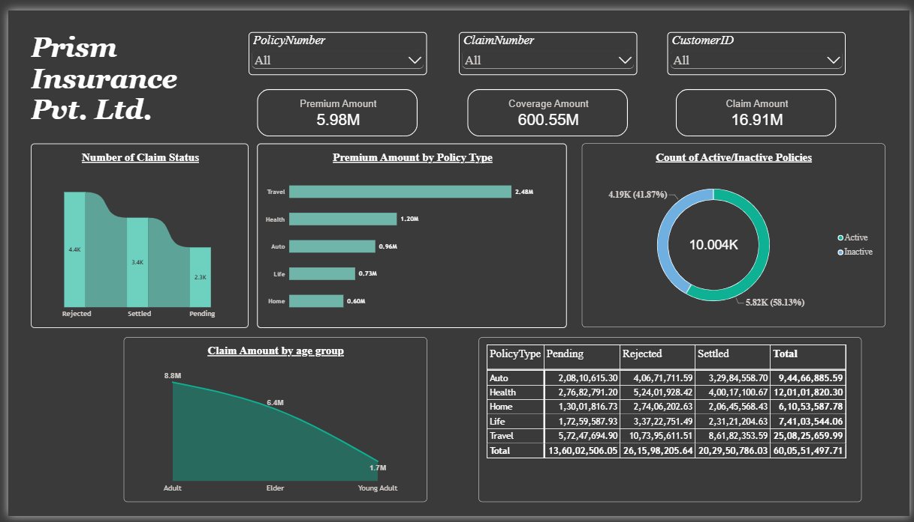
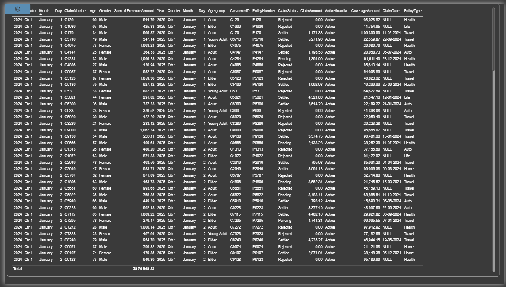
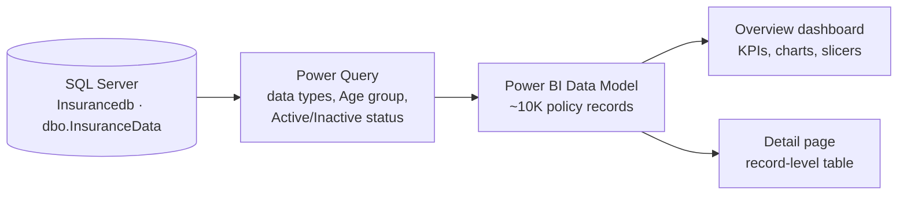

<h1 align="center">🛡️ Prism Insurance | Claims & Policy Analytics Dashboard</h1>

<p align="center">
  <b>An interactive Power BI report analysing ~10K insurance policies: premiums, coverage, claims and policy status</b>
</p>

<p align="center">
  
  
  
  
  
</p>

---

## 📊 At a Glance

| 🧾 Policies | 💰 Total Premium | 🛡️ Total Coverage | 📋 Total Claim Amount | ✅ Active Policies |
|:---:|:---:|:---:|:---:|:---:|
| **~10K** | **5.98M** | **600.55M** | **16.91M** | **58%** |

<p align="center">
  
</p>
<p align="center"><i>Overview page: KPI cards, claim status, premium by policy type, active vs inactive policies, claims by age group, and coverage by policy type and claim status.</i></p>

---

## 🎯 Project Objective

Give an insurance company a single view of **what it sells, how claims are being handled, and where the money goes**, so managers can quickly spot risk in the claims process.

**Questions the dashboard answers**

- How many claims are settled, pending or rejected?
- Which policy types bring in the most premium and carry the most coverage?
- How many policies are still active, and how many have lapsed?
- Which age group accounts for the most claim value?
- How does coverage split across claim outcomes for each policy type?

---

## 🗂️ Dashboard Pages

### 1. Insurance Overview
Three KPI cards (premium, coverage, claim amount), a claim status chart, premium by policy type, an active/inactive donut, claim amount by age group, and a matrix of coverage by policy type and claim status. Slicers filter the whole page.

### 2. Policy & Claim Details
A record-level table with every policy and claim: customer, age, gender, policy dates, premium, coverage, claim number, claim date, claim amount and claim status.

<p align="center">
  
</p>

---

## 💡 Key Insights

1. **Travel is the biggest line of business.** It brings in 2.48M of the 5.98M total premium (about 41%) and holds the most coverage, while Home is the smallest at 0.60M.
2. **Rejections are the most common claim outcome.** About 43.5% of claims are rejected, 33.8% are settled and 22.6% are still pending.
3. **Claims are much larger than premiums.** Claim amount (settled plus pending) is 16.91M, about 2.8x the 5.98M collected in premium, and the ratio stays between 2.6x and 2.9x for every policy type.
4. **Around 42% of policies are inactive.** Only 58% of policies are still active, which points to a retention or renewal issue.
5. **Adults account for over half of claim value** (8.8M, about 52%), followed by Elders (6.4M) and Young Adults (1.7M). The average claim per policy is almost the same across groups, so the difference comes from group size, not bigger claims.
6. **Rejected claims carry the largest share of coverage** (about 262M of 600M, roughly 44%), followed by settled (203M) and pending (136M).

---

## 🔄 Data Flow



**Derived fields created in Power Query**

| Field | Rule |
|---|---|
| **Age group** | Age 24 or under = *Young Adult*, 25 to 60 = *Adult*, over 60 = *Elder* |
| **Active/Inactive** | Policy end date on or before 10 Dec 2024 = *Inactive*, otherwise *Active* |

**Main fields:** PolicyNumber, CustomerID, Gender, Age, PolicyType, PolicyStartDate, PolicyEndDate, PremiumAmount, CoverageAmount, ClaimNumber, ClaimDate, ClaimAmount, ClaimStatus.

> **Note on the data source:** the data was loaded from a local SQL Server database. The `.pbix` file stores a snapshot of the data, so it opens normally on any computer, but *Refresh* will not work without that database.

---

## 🛠️ Skills Demonstrated

| Area | Details |
|---|---|
| **Data connection** | Importing data from SQL Server into Power BI |
| **Data preparation** | Power Query: changing data types, conditional columns, filtering |
| **Visualisation** | Donut, bar, area/line, ribbon, matrix, KPI cards, slicers |
| **Report design** | Dark theme, multi-page layout, consistent formatting |
| **Analysis** | Claim status analysis, premium vs claim comparison, age-group analysis |

---

## ▶️ How to Open

1. Download **`InsuranceData.pbix`** from this repository.
2. Open it in [Power BI Desktop](https://powerbi.microsoft.com/desktop/) (free, Windows).

---

## 🚀 Future Improvements

- Add **DAX measures** for claim ratio, rejection rate and average claim value
- Split the single table into a **star schema** (customer, policy, claim and date tables)
- Add a **time trend** using policy start date, and a **gender** breakdown
- Add an alert-style view for policies about to expire

---

## 📁 Repository Structure

```
├── InsuranceData.pbix       # Power BI report
├── README.md
└── screenshots/             # Dashboard page previews
```

---

## 👤 Author

**Your Name** &nbsp;|&nbsp; [GitHub](https://github.com/yashi-dev21) &nbsp;|&nbsp; [LinkedIn](https://www.linkedin.com/in/yashika-mule-91668b248) &nbsp;|&nbsp; [Email](yashikamule219@gmail.com)
